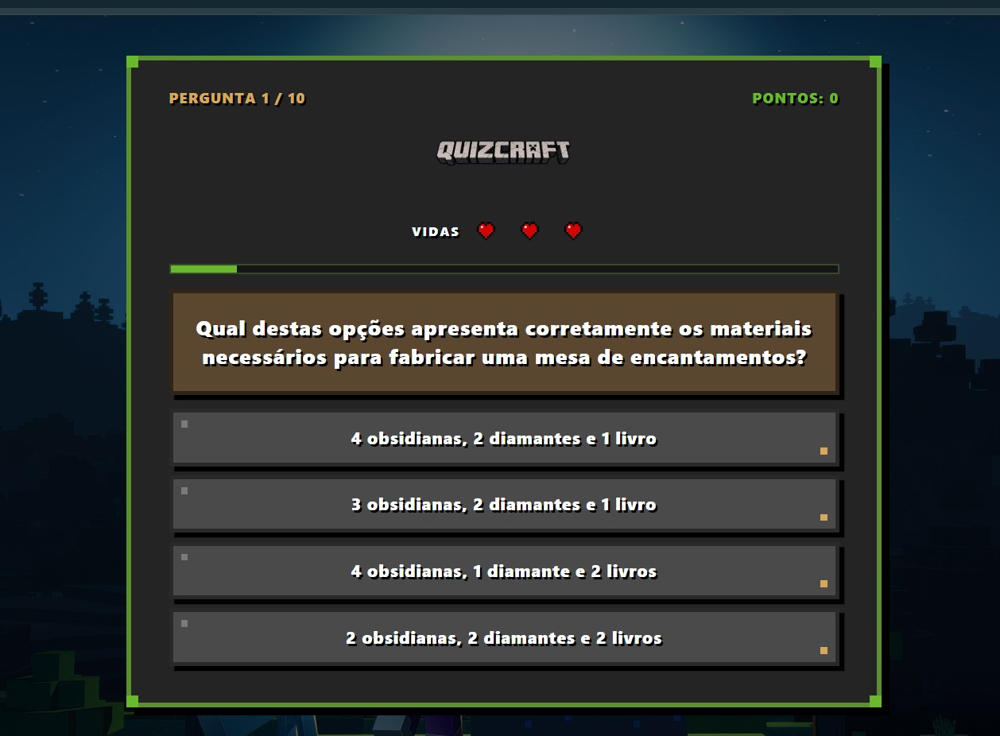

# QuizCraft

Quiz interativo sobre o universo de Minecraft, desenvolvido com React Native e Expo. O objetivo do projeto é testar os conhecimentos dos jogadores por meio de questões de múltipla escolha com um layout responsivo e temático.

---


## Demonstração

<p align="center">
  
</p>

<p align="center">
  <video src="./assets/exemplo.webm" width="300" controls muted></video>
</p>

<p align="center">
  📥 <a href="./assets/exemplo.webm" download>Clique aqui para baixar o vídeo de demonstração</a>
</p>

---

## Funcionalidades

- **Tela Inicial:** Apresentação visual com identidade temática de Minecraft e botão interativo para iniciar a partida.
- **Sorteio Dinâmico de Perguntas:** A cada partida, o sistema seleciona aleatoriamente 10 perguntas de um banco de dados contendo 20 questões disponíveis em formato JSON.
- **Sistema de Múltipla Escolha:** Cada questão apresenta quatro alternativas de resposta.
- **Feedback Visual Instantâneo:** Ao selecionar uma alternativa, o sistema bloqueia novas interações temporariamente e colore a resposta escolhida de verde (se correta) ou de vermelho (se incorreta), destacando também a resposta certa caso o usuário erre.
- **Sistema de Vidas:** O jogador inicia cada partida com 3 vidas representadas por corações na interface. Errar uma resposta diminui uma vida.
- **Barra de Progresso:** Indicador visual em tempo real do avanço do jogador pelas perguntas da partida.
- **Tela de Resultados:** Exibe a pontuação final obtida, mensagem de desempenho personalizada baseada no aproveitamento e a opção de reiniciar o quiz.
- **Layout Responsivo:** Adaptado automaticamente para diferentes tamanhos de tela, oferecendo suporte otimizado tanto para dispositivos móveis quanto para computadores (web).

---

## Mecânica do Sistema de Vidas

O gerenciamento de vidas do QuizCraft foi construído utilizando estados reativos do React Native (`useState`). A lógica funciona da seguinte forma:

1. **Inicialização:** A partida começa com o valor de `lives` definido como `3`.
2. **Erro na Resposta:** Quando o usuário seleciona uma alternativa incorreta, a função de resposta aciona a atualização do estado decrementando uma vida (`prevLives - 1`).
3. **Condição de Game Over:** 
   - Se o número de vidas restantes chegar a `0`, o sistema exibe a alternativa correta por um breve intervalo (700ms) e direciona automaticamente o jogador para a tela de resultados (`isQuizFinished = true`), encerrando a partida de forma antecipada.
   - Caso o jogador ainda possua vidas (`lives > 0`), o sistema exibe o feedback visual da resposta errada e avança automaticamente para a próxima pergunta após 700ms.

---

## Tecnologias Utilizadas

Este projeto foi construído utilizando as seguintes tecnologias e ferramentas:

* **[React Native](https://reactnative.dev/):** Framework para o desenvolvimento de aplicações multiplataforma.
* **[Expo](https://expo.dev/):** Plataforma para construção e gerenciamento de aplicações React Native.
* **[TypeScript](https://www.typescriptlang.org/):** Superset do JavaScript que adiciona tipagem estática ao código.
* **JSON:** Formato utilizado para estruturação, armazenamento e leitura local das perguntas do quiz.
* **Git & GitHub:** Controle de versão e hospedagem do código-fonte.

---

## Como Executar o Projeto

### Pré-requisitos
Certifique-se de ter instalado em sua máquina:
- Node.js
- Gerenciador de pacotes npm ou yarn
- Aplicativo Expo Go instalado em seu dispositivo móvel (ou um emulador configurado)

### Passos para instalação

1. Clone o repositório:
   ```bash
   git clone https://github.com/AnaClaraMendes399/quiz-app.git